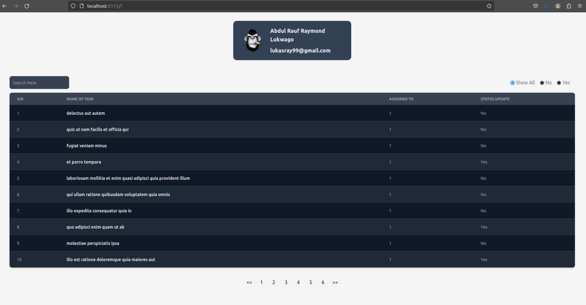

# Dynamic Filter Table Component in Vue

    

## Description :book:
This is a table component that displays your data in Vue in a more dynamic and searchable manner
Features: Front-end Pagination, Search Form, Filter
In this project, we use computed properties, events, Props, API fetch requests and emit to build out components that enable filtering and searching of the table data.
The Vue2 Option API was used and Tailwind CSS was employed for quick styling.

## Built With :email:
- [JavaScript](https://javascript.info/) - Programming Language
- [Vite](https://vitejs.dev/) - Web Framework
- [Tailwind CSS](https://tailwindcss.com/docs/installation) - Styling Library
- [npm](https://www.npmjs.com/) - Package and Dependency Management

## Authors :black_nib:
- Raymond Lukwago - [Github](https://github.com/lukwagoraymond) / [LinkedIn](https://www.linkedin.com/in/raymondlukwago/)
